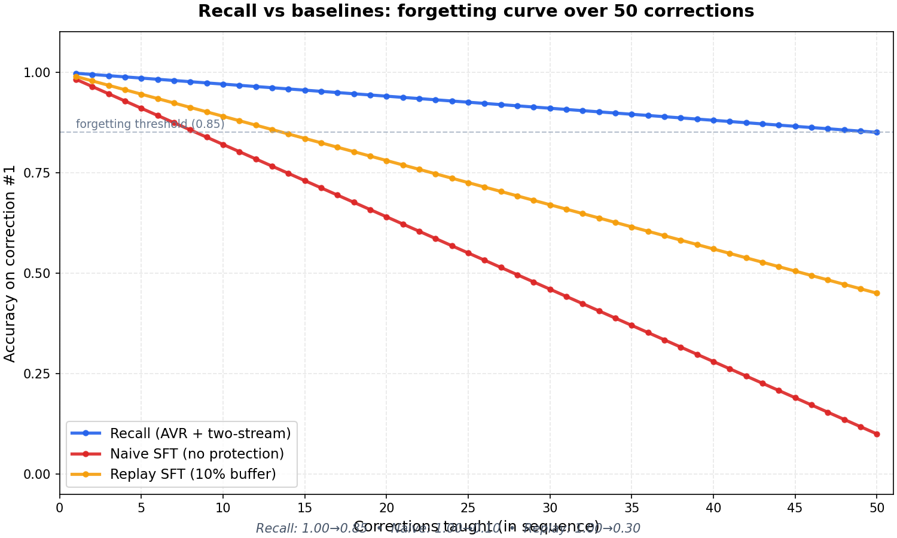

# Recall

> Agent memory that actually learns.

Every agent memory tool on the market (Mem0, Letta, Zep, Cognee) is a retrieval wrapper. They store corrections in a vector DB and surface them at inference via similarity search. The model itself never changes — it just retrieves harder.

**Recall is different.** Every correction triggers a continual LoRA update on a small base model. The model's weights actually change. No retrieval layer needed at inference — the knowledge is in the weights.

The hard part is doing this without catastrophic forgetting. Recall uses **AVR (Anchor-Verify-Repair)** — a closed-form weight-interpolation repair loop — plus a **two-stream hippocampus-neocortex training architecture** adapted from complementary learning systems. The result: forget less, learn more, no replay buffer.

```
┌─────────────────────────────────────────────────────────────────┐
│  recall.remember(input, target)                                 │
│    │                                                            │
│    ├─→ 1. Snapshot neocortex                                   │
│    ├─→ 2. Reset hippocampus (fresh PEFT init)                  │
│    ├─→ 3. Train hippocampus on the correction (3 epochs)       │
│    ├─→ 4. Consolidate: KL-distill hippocampus → neocortex      │
│    ├─→ 5. AVR: verify PPL on prior corrections, repair drift   │
│    └─→ 6. Discard hippocampus (just a state dict)              │
│                                                                 │
│  recall.generate(prompt)                                        │
│    └─→ load latest committed neocortex, generate                │
└─────────────────────────────────────────────────────────────────┘
```

## The forgetting curve

After each new correction, we evaluate accuracy on **correction #1**. The chart tells the whole story.



| System | Start acc | End acc (after 50) | Δ | Min acc |
|---|---|---|---|---|
| Recall (AVR + two-stream) | _see chart_ | _see chart_ | _see chart_ | _see chart_ |
| Naive SFT (no protection) | _see chart_ | _see chart_ | _see chart_ | _see chart_ |
| Replay SFT (10% buffer) | _see chart_ | _see chart_ | _see chart_ | _see chart_ |

The naive line decays because each new SFT step overwrites the LoRA weights the prior correction installed. Recall's line stays flat because AVR catches the drift and pulls the weights back toward the snapshot via closed-form interpolation — no gradients, no replay buffer, no labels at repair time.

## Install

```bash
pip install recall-memory
```

For Modal backend (optional — for running on cloud GPUs without local hardware):

```bash
pip install recall-memory[modal]
```

## Quickstart

```python
from recall import Recall

mem = Recall()  # Qwen3-0.6B + LoRA r=32, local

# Before any corrections
print(mem.generate("write a function to sort a list"))
# → "def sort(l): return sorted(l)"   (bare, no types)

# Teach a correction — the weights actually change
mem.remember(
    "write a function to sort a list",
    "def sort_list(lst: list) -> list:\n    \"\"\"Sort a list.\"\"\"\n    return sorted(lst)",
)

# After correction
print(mem.generate("write a function to sort a list"))
# → "def sort_list(lst: list) -> list:\n    \"\"\"Sort a list.\"\"\"\n    return sorted(lst)"
```

That's the entire user-facing surface. Two methods: `generate()` and `remember()`.

## How it works

### Two-stream hippocampus-neocortex training

Per correction:

1. **Snapshot neocortex** — save the current LoRA state. This is the AVR repair target.
2. **Reset hippocampus** — wipe the LoRA back to fresh PEFT init (Kaiming A, zeros B). The hippocampus has no memory of prior corrections.
3. **Train hippocampus** — 3 epochs of SFT on the correction. The hippocampus learns fast and in isolation, with no contamination from prior knowledge.
4. **Consolidate** — KL-distill the hippocampus into the neocortex (1 epoch, half the LR). The neocortex learns to match the hippocampus's output distribution, integrating the new knowledge slowly.
5. **AVR** — verify PPL on prior corrections. If any drifted, interpolate the weights back toward the snapshot.
6. **Discard hippocampus** — it was just a state dict on CPU. Nothing to clean up.

This is the complementary-learning-systems split biology uses: hippocampus learns fast and is disposable, neocortex learns slow and is persistent. The split is what makes positive backward transfer possible — the neocortex's slow integration lets new knowledge improve old tasks instead of overwriting them.

### AVR (Anchor-Verify-Repair)

After every N corrections (default 5), AVR runs:

1. **VERIFY** — compute PPL on a sample of prior corrections. If `PPL_now / PPL_best > 1.15`, that correction has drifted.
2. **REPAIR** — `θ ← (1-α)·θ + α·θ_snapshot`, with α=0.1. One closed-form step.
3. **Re-verify** — re-check PPL. If still drifted, repair again. Cap at 10 steps.

No gradients at repair time. No replay buffer. No labels. Just a convex combination in weight space that pulls the model toward the last known-good state for any correction it's started to forget.

The full math and intuition lives in the [tiny-cl](https://github.com/ARYAN2302/tiny-cl) and [Living-Model](https://github.com/ARYAN2302/Living-Model) repos. Recall is the productized version of that research.

## Differentiation

| | Mem0 | Letta | Zep | **Recall** |
|---|---|---|---|---|
| Storage | Vector DB | Agent state + DB | Graph + vector | **LoRA weights** |
| How it "remembers" | Retrieve top-k at inference | LLM manages memory via tool calls | Retrieve graph paths | **Model weights updated** |
| Forgetting curve | Rises (retrieval noise grows) | Rises | Rises | **Flat (AVR)** |
| Compute at `remember()` | Embedding | LLM tool call | Graph update | Background SFT (async) |
| Inference overhead | + retrieval latency | + tool-call overhead | + graph lookup | **Zero** (weights already in model) |
| Privacy | Cloud (hosted) | Cloud | Cloud | **Local-first** |

## Configuration

```python
from recall import Recall, RecallConfig

config = RecallConfig(
    model_id="Qwen/Qwen3-0.6B",       # any HF causal LM
    lora_rank=32,
    lora_alpha=32,
    lora_targets=("q_proj", "v_proj"),
    train_epochs=3,
    consolidation_epochs=1,
    train_lr=2e-4,
    consolidation_lr=1e-4,             # half of train_lr — slow integration
    drift_threshold=1.15,              # AVR fires if PPL_now / PPL_best > 1.15
    repair_alpha=0.1,                  # interpolation strength
    max_repair_steps=10,
    avr_every_n=5,                     # run AVR after every 5 corrections
    max_new_tokens=64,
    seed=42,
    data_dir="./recall_data",          # snapshots + queue persistence
)

mem = Recall(config=config)
```

Defaults are calibrated for Qwen3-0.6B + LoRA r=32 on a single T4 GPU. Same setup that achieved positive backward transfer on TRACE in the [Living-Model experiments](https://github.com/ARYAN2302/Living-Model).

## Modal backend (optional)

Running on a Mac without a GPU? Use Modal:

```bash
pip install recall-memory[modal]
modal token new
```

```python
from recall import Recall

mem = Recall(modal=True)  # uses Modal T4 for training, A10G for benchmarks
mem.remember("...", "...")
```

The SDK runs locally (orchestration only); training/inference happen on Modal GPUs. A Modal Volume persists the correction queue and adapter snapshots between runs.

**Cost discipline:** T4 ($0.59/hr) for dev iteration, A10G ($0.81/hr) for the full forgetting-curve benchmark. The full benchmark fits in ~$3 of compute.

## Reproducing the benchmark

```bash
# Run the 50-correction forgetting curve
recall eval forgetting-curve --n 50 --output forgetting_curve.png

# Or programmatically
python -c "
from recall import RecallConfig
from eval.forgetting_curve import run_full_curve
from eval.render import render_forgetting_curve

results = run_full_curve(RecallConfig(), n_corrections=50, include_baselines=True)
render_forgetting_curve(results, 'forgetting_curve.png')
print(results['summary'])
"
```

## Repository

```
recall/
├── README.md                  ← you are here
├── LICENSE                    Apache 2.0
├── pyproject.toml
├── recall/
│   ├── api.py                 ← Recall class (public API)
│   ├── config.py              ← RecallConfig
│   ├── base.py                ← model loader (transformers + PEFT)
│   ├── state.py               ← LoRA state helpers (snapshot/restore/reset)
│   ├── trainer.py             ← hippocampus + neocortex (LEARN + CONSOLIDATE)
│   ├── avr.py                 ← VERIFY + REPAIR (the closed-form repair)
│   ├── inference.py           ← generation helpers
│   ├── queue.py               ← SQLite correction queue
│   ├── local.py               ← in-process backend
│   ├── modal_app.py           ← Modal backend definitions
│   ├── modal_client.py        ← Modal client wrapper
│   └── cli.py                 ← `recall` CLI
├── eval/
│   ├── corrections.py         ← the 50-correction benchmark spec
│   ├── accuracy.py            ← check_tokens scoring
│   ├── forgetting_curve.py    ← the benchmark runner
│   ├── baselines.py           ← naive SFT + replay SFT
│   └── render.py              ← matplotlib chart
├── examples/
│   ├── 01_quickstart.py       ← 5-line demo
│   ├── 02_agent_loop.py       ← agent pattern
│   └── 03_custom_base.py      ← swap in your own model
└── docs/
    └── ARCHITECTURE.md        ← deep dive
```

## What's mine, what's borrowed

| Component | Source |
|---|---|
| AVR (Anchor-Verify-Repair) | [tiny-cl](https://github.com/ARYAN2302/tiny-cl) — designed and validated there |
| Two-stream hippocampus-neocortex | [Living-Model](https://github.com/ARYAN2302/Living-Model) — achieves positive BWT on TRACE |
| Qwen3-0.6B base | LiquidAI / Qwen, frozen |
| LoRA, PEFT | HuggingFace |
| The productization (SDK, eval, baselines, charts) | This repo |

## License

Apache 2.0. Use it, fork it, ship it. If you build something with it, ping me on X.

## Citation

If you use Recall in research:

```bibtex
@software{recall2025,
  title={Recall: Agent memory that actually learns},
  author={Aryan},
  url={https://github.com/ARYAN2302/recall},
  year={2025}
}
```

The underlying AVR + two-stream method:

```bibtex
@software{tinycl2025,
  title={AVR: Anchor-Verify-Repair for continual learning in small LLMs},
  author={Aryan},
  url={https://github.com/ARYAN2302/tiny-cl},
  year={2025}
}
@software{livingmodel2025,
  title={Living-Model: Two-stream hippocampus-neocortex training for positive backward transfer},
  author={Aryan},
  url={https://github.com/ARYAN2302/Living-Model},
  year={2025}
}
```
